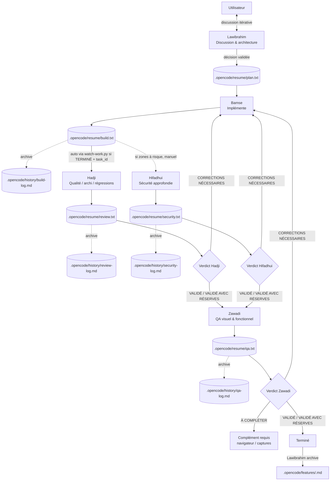

# Sayrhazi

**Sayrhazi** est un workflow multi-agents portable pour structurer le développement logiciel, orchestré via [OpenCode](https://opencode.ai). Il peut être installé dans une application, un site web, une API ou tout autre projet technique. Chaque agent a un rôle précis et cloisonné.

### Origine du nom

**Sayrhazi** (prononcé *Sayrazi*, le « h » restant muet) fusionne deux racines :
- **Sayr** (سير), terme arabe désignant le cheminement, le déroulement d'un processus.
- **Hazi**, mot comorien signifiant le travail.

## Vue d'ensemble



Tous les agents respectent les règles communes (`AGENTS.md` du projet) : lire `.opencode/sayrhazi.yaml` comme seule source de vérité, ne jamais supposer le nom du projet, se présenter avec nom + type + stack, répondre en français sans emoji.

## Les agents

| Agent | Fichier | Rôle | Modèle |
|---|---|---|---|
| **Lawibrahim** | `agent/lawibrahim.md` | Partenaire de réflexion — discute architecture et fonctionnalités avant qu'une tâche soit lancée. N'implémente et ne review jamais. | `muse-spark-1.3` |
| **Bamse** | `agent/bamse.md` | Développeur principal — implémente à partir de `plan.txt`, vérifie, écrit `build.txt`. Seul à modifier le code. | `muse-spark-1.3` |
| **Hadji** | `agent/hadji.md` | Reviewer qualité — bugs, régressions, architecture, performance. **Ne couvre pas la sécurité.** | `muse-spark-1.3` |
| **Hifadhui** | `agent/hifadhui.md` | Spécialiste sécurité — injections, auth/sessions, secrets, dépendances, contrôle d'accès. | `muse-spark-1.3` |
| **Zawadi** | `agent/zawadi.md` | Testeuse QA visuelle et fonctionnelle — rendu réel, responsive, modes clair/sombre, parcours. Ne déduit jamais un rendu du seul code. | `muse-spark-1.3` (vision) |

Tous en `mode: primary` — on parle à un seul agent à la fois. Le flux de base est `Lawibrahim → Bamse → Hadji`, avec Hifadhui sur les zones à risque et Zawadi sur le rendu observable. Les noms d'affichage sont modifiables par projet via `agents:` dans `sayrhazi.yaml` (fichiers et rôles stables).

## Les fichiers de suivi

### État courant (`.opencode/resume/`)

Chaque fichier est **remplacé** à chaque passage — il ne contient que le dernier état, pour rester rapide à lire.

| Fichier | Écrit par | Lu par |
|---|---|---|
| `plan.txt` | Lawibrahim | Bamse |
| `build.txt` | Bamse | Hadji, Hifadhui, Zawadi |
| `review.txt` | Hadji | Bamse (si corrections), Zawadi |
| `security.txt` | Hifadhui | Bamse (si corrections) |
| `qa.txt` | Zawadi | Bamse (si corrections signalées) |

Chaque rapport contient : date système réelle, projet, tâche (`task_id:` stable, ex. `FEATURE-001`), `status:`, vérifications, problèmes classés `CRITIQUE / HAUTE / MOYENNE / FAIBLE`, limites, suite et verdict du rôle. Aucun secret dans les rapports.

### Historique (`.opencode/history/`)

Avant de remplacer son fichier `resume/`, chaque agent archive l'ancien contenu ici : `build-log.md`, `review-log.md`, `security-log.md`, `qa-log.md`. `plan.txt` reste cumulatif jusqu'à l'archivage explicite d'une feature dans `.opencode/features/<nom>.md`.

## Comment ça se déroule concrètement

1. **Discussion** — avec Lawibrahim. Une fois d'accord, il note la décision dans `plan.txt` (`À IMPLÉMENTER` ou `INFORMATIF`), uniquement après confirmation explicite.
2. **Implémentation** — Bamse consulte `plan.txt`, code, vérifie, écrit `build.txt` (`EN COURS`, `TERMINÉ` ou `BLOQUÉ`).
3. **Review qualité** — Hadji lit `build.txt`, inspecte le code, écrit `review.txt` (`VALIDÉ`, `VALIDÉ AVEC RÉSERVES` ou `CORRECTIONS NÉCESSAIRES`). Déclenchable auto via `watch-work.py` quand `build.txt` est `TERMINÉ` avec `task_id`.
4. **Audit sécurité** (si pertinent) — Hifadhui audite et écrit `security.txt`.
5. **QA** (une fois les reviews OK) — Zawadi teste en navigateur réel (Playwright si configuré, sinon captures) et écrit `qa.txt` (`VALIDÉ`, `VALIDÉ AVEC RÉSERVES`, `CORRECTIONS NÉCESSAIRES` ou `À COMPLÉTER`).
6. **Corrections** — si un verdict l'exige, Bamse reprend. Le cycle repart de l'étape 2.
7. **Terminé** — Lawibrahim archive la feature bouclée dans `.opencode/features/`.

## Docker est-il nécessaire ?

**Non, pas par défaut.** Le fichier `.opencode/sayrhazi.yaml` est uniquement un fichier de configuration : nom, stack, commandes, exigences qualité. Un YAML ne lance aucun conteneur.

Docker devient utile uniquement si le projet applicatif l'exige (PostgreSQL, Redis, environnement reproductible...). Dans ce cas, Docker appartient au projet applicatif, pas au noyau Sayrhazi.

## Architecture

Sayrhazi est séparé du code de chaque projet :

```text
Sayrhazi/      # noyau : agents, template, schemas, scripts, docs
MonProjet/     # projet : code + .opencode/ + AGENTS.md
```

Chaque projet possède sa propre copie de `.opencode/agent/` (`sayrhazi.yaml`, `opencode.json`, `watch-work.py`, `resume/`, `history/`, `features/`). Les rapports et historiques ne sont jamais partagés entre projets. Les agents ne supposent jamais le nom du projet : ils lisent `.opencode/sayrhazi.yaml`.

## Installation dans un projet

Depuis n'importe quel projet (inutile d'ouvrir le dépôt Sayrhazi) :

```powershell
& "C:\Users\Lawibrahim\Documents\Sayrhazi\scripts\Install-Sayrhazi.ps1" -ProjectPath "."
```

Avec les fonctions de profil : `Sayrhazi .` (installe + contrôle), `tunda sayrhazi` (check détaillé : structure, 5 agents, 0 `A_COMPLETER`, JSON valide, watcher).

Le script ne supprime ni ne remplace rapports, historiques, décisions ou configuration existants. Après installation, compléter `.opencode/sayrhazi.yaml`, renseigner les règles locales (`AGENTS.md` §4), puis vérifier avec `tunda sayrhazi`.

## Zawadi et Playwright (optionnel)

Zawadi peut piloter un vrai navigateur via un serveur MCP Playwright :

```json
{
  "$schema": "https://opencode.ai/config.json",
  "mcp": {
    "playwright": {
      "type": "local",
      "command": ["npx", "-y", "@playwright/mcp@latest"],
      "enabled": true
    }
  },
  "permission": {
    "playwright_*": "deny"
  }
}
```

Le `deny` global empêche les autres agents d'y accéder ; seul `zawadi.md` a `playwright_*: allow`. Sans navigateur ni captures, Zawadi rend le verdict `À COMPLÉTER` au lieu d'inventer un rendu.

## Automatisation

Le cœur fonctionne manuellement ; `watch-work.py` (installé dans `.opencode/`) automatise une seule transition : `build.txt TERMINÉ` + `task_id` → Hadji → vérification de `review.txt`. Il refuse les rapports incomplets, empêche les doubles déclenchements et applique un timeout. Pas de retour auto vers Bamse, pas de boucle après review négative : les décisions restent humaines.

Limites connues : permissions en mode headless, fichiers créés hors projet (Bamse doit travailler dans le projet), sessions longues interrompues.

## Étendre le système

Pour ajouter un agent : créer `agents/<nom>.md` (frontmatter `description`/`mode`/`model`, sans nom de projet en dur), lui donner son fichier `resume/` + journal `history/`, ne lui faire lire que le nécessaire, mettre à jour agents, docs, template et `CHANGELOG.md`.

## Versionnement

Le noyau est versionné séparément des projets (voir `CHANGELOG.md`, tags `v0.x.y`). Après modification des agents ou templates, déployer la nouvelle copie projet par projet (`Sayrhazi .` met à jour agents et watcher sans écraser la config).
